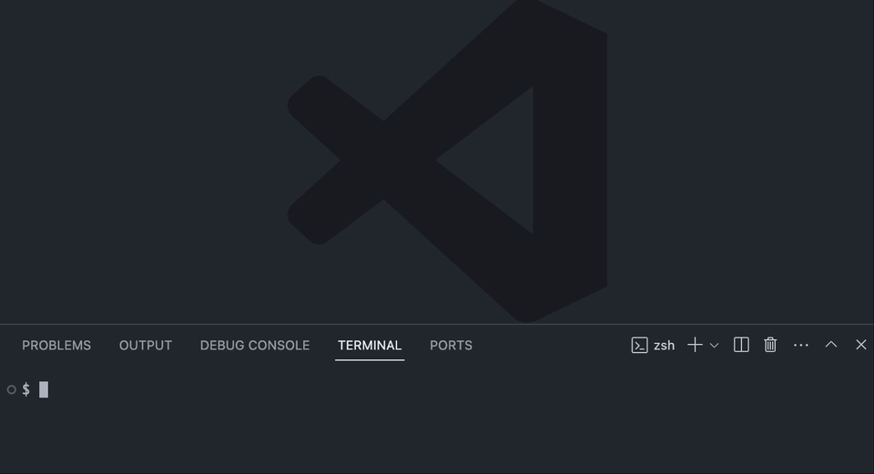

## Gogi: A simple .gitignore template manager


> [!IMPORTANT]  
> While the features are stable, this is still a work in progress


### Installation
Deploy Gogi with the following command:
```bash
go install github.com/SQUASHD/gogi@latest
```

### Configuration
Initialize Gogi to set up a dedicated template directory within your `.config` folder:
```bash
gogi init
```

### Template Management

Craft a new, blank template 
```bash
gogi create <template-name> [-e open in editor] [-b set as base]
```

Specify your preferred editor for template customization:
```bash
gogi editor <editor-name>
```

Modify an existing template to suit your project needs:
```bash
gogi edit <template-name>
```

Establish a default template for new projects:
```bash
gogi base <template-name>
```

### Generate .gitignore
Generate a .gitignore file using your base template directly in your current project directory:
```bash
gogi
```

### Assistance
See the whole suite of Gogi commands:
```bash
gogi help
```
